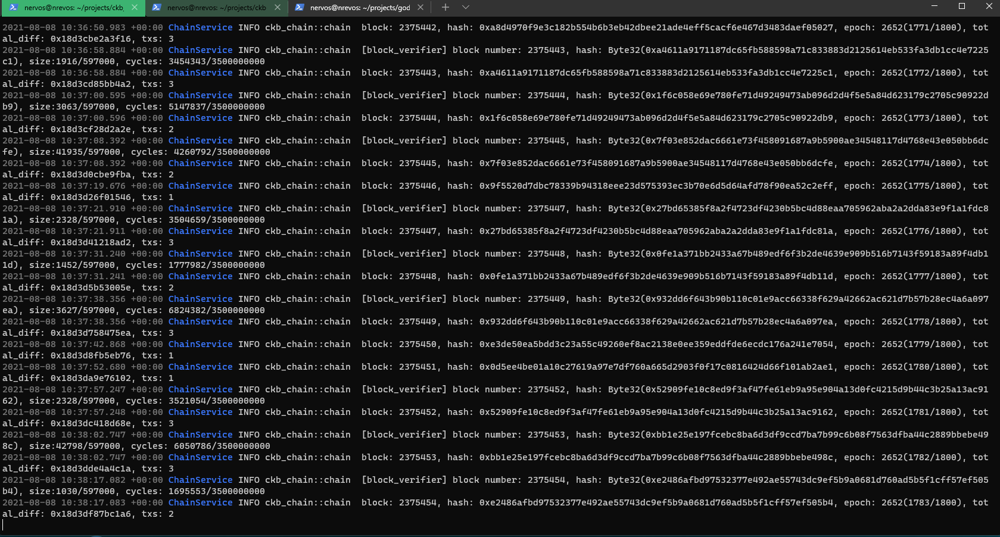
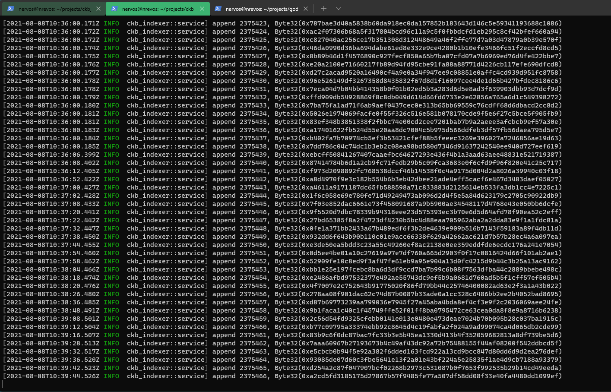
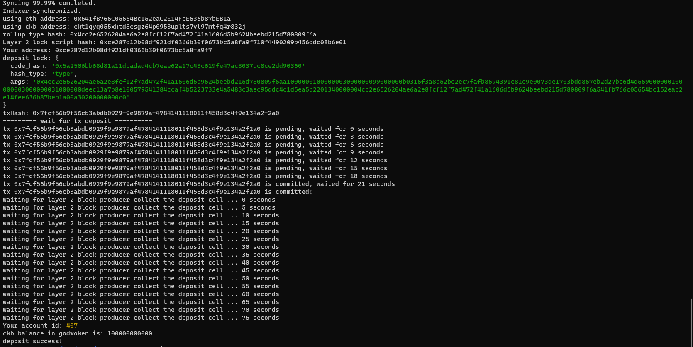
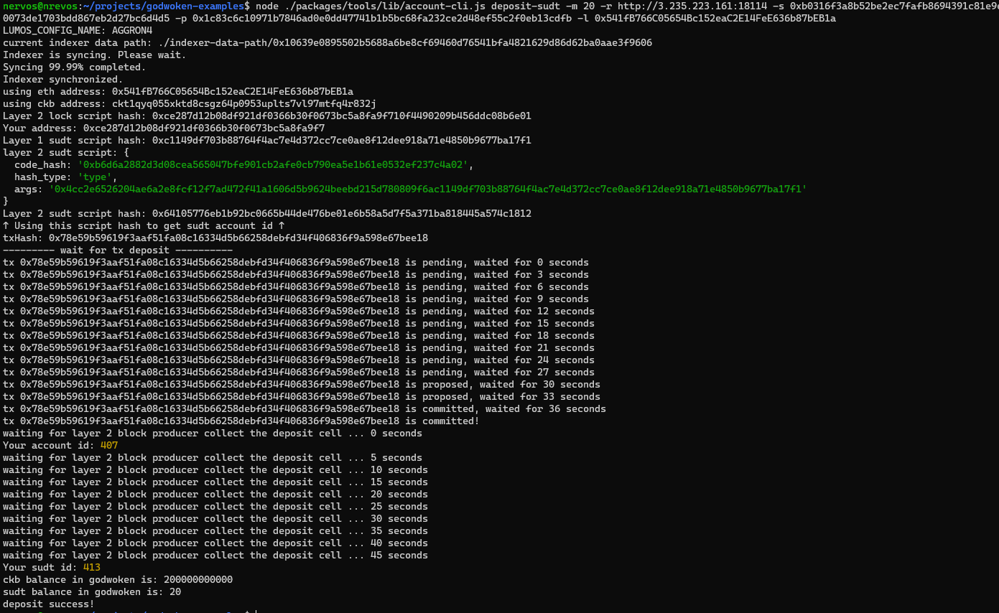
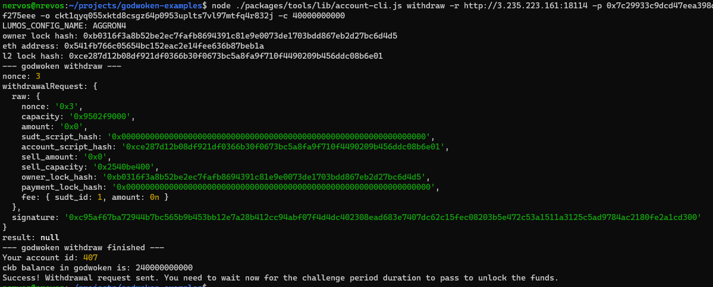

# nervoshackathon

- [nervoshackathon](#nervoshackathon)
  - [Task 0](#task-0)
  - [Task 1](#task-1)
  - [Task 2](#task-2)
  - [Task 3](#task-3)
  - [Task 4](#task-4)
  - [Task 5](#task-5)
  - [Task 6](#task-6)
  - [Task 9](#task-9)
  - [Task 10](#task-10)

## Task 0

1. A screenshot of the console output from your local Testnet CKB Node after it has fully synchronized with the network.

2. A screenshot of the console output from your local CKB Indexer after it has fully synchronized with the local Testnet CKB Node.

## Task 1

1. screenshot of the accounts you created (account list) in ckb-cli.

1. link to the Layer 1 address you funded on the Testnet Explorer.

[Testnet Explorer Layer 1 address](https://explorer.nervos.org/aggron/address/ckt1qyq055xktd8csgz64p0953uplts7vl97mtfq4r832j)

3. screenshot of the console output immediately after you have successfully submitted a deposit to Layer 2.

## Task 2

1. A screenshot of the console output immediately after you have successfully deployed a smart contract.

2. The transaction hash from the contract deployment (in text format).

Transaction hash: 0x705efefe348da9e8705aa0f31c05694521b61dcfd29b88b1acfb910bda8f60d1

3. The deployed contract address from the contract deployment (in text format).

Deployed contract address: 0xb85e8036c408e0e14E1f053ff55b471283352D26

## Task 3

1. A screenshot of the console output immediately after you have successfully issued a smart contract call.

2. The transaction hash from the console output (in text format).

0xf09660b9ecb049de1785e50b1bd2339525a5f77919f0def394783e110c1a9d64

3. The contract address that you called (in text format).

0xb85e8036c408e0e14E1f053ff55b471283352D26

4. The ABI for contract you made a call on (in text format).

[{"inputs": [],"stateMutability": "payable","type": "constructor"},{"inputs": [{"internalType": "uint256","name": "x","type": "uint256
"}],"name": "set","outputs": [],"stateMutability": "payable","type": "function"},{ "inputs": [],"name": "get","outputs": [{"internalType": "uint256","name": "","type": "uint256"}],"stateMutability": "view","type": "function"}]

## Task 4

1. A link to the Layer 1 address you funded on the Testnet Explorer.

[Funded Layer 1 address](https://explorer.nervos.org/aggron/address/ckt1qyq055xktd8csgz64p0953uplts7vl97mtfq4r832j)

2. A screenshot of the console output immediately after using sudt-cli to create your SUDT tokens on Layer 1.

3. A link to the transaction ID created by sudt-cli on the Testnet Explorer.

[SUDT transaction](https://explorer.nervos.org/aggron/transaction/0xc698ba04b3170a227cf049411c98c19c1846a4aadf620a221056500740b050b6)

4. A screenshot of the console output immediately after you have successfully submitted a deposit to Layer 2 using the account-cli tool.

5. The SUDT ID from the console output after executing the deposit script (in text format).

413

## Task 5

1. A screenshot of the console output immediately after deploying smart contract.

2. The address of the ERC20 Proxy Contract you deployed (in text format).

0x0fBf7C6CDC91fBDDE9177f95DB6040dcf7Fad787

3. A screenshot of the console output immediately after checking your SUDT balance.

4. The Ethereum address that was checked (in text format).

0x541fB766C05654Bc152eaC2E14FeE636b87bEB1a

## Task 6

1. A screenshot of the console output immediately after you have successfully generated your Deposit Receiver Address.

2. Your Deposit Receiver Address (in text format).

ckt1q3dz2p4mdrvp5ywu4kk5edl2uc4p03puvx07g7kgqdau3n3dmypkqnxzuefxyp9wdghglncj77k5wt6p59sx6kukyjlwh5s467qgp8m25yqqqqqsqqqqqvqqqqqfjqqqqq7ve8m99jw6jc5z270capglyapjqgxzra79ntxke0hede6cmjcsw6gqqqqpqqqqqqcqqqqqxyqqqqx7asf60w8pqpte2sfcfn90fdfzxue7ff2g8sawe9wacnqat6jmygqngqqqqpxv9ejjvgz2u63w3l839aadguh5rgtqd4devf97a0fpt4uqsz0k54qlkanvq4j5hs2jatpwznlwvd4c00435q9rqgqqqqqqcqt9znpa

3. The Ethereum address used to generate the Deposit Receiver Address (in text format).

0x541fB766C05654Bc152eaC2E14FeE636b87bEB1a

4. A link to the Etherscan explorer for the successful Force Bridge transaction. This can be found on Force Bridge under History→Succeed.

[Etherscan Transaction](https://rinkeby.etherscan.io/tx/0x82acca2a2bbd0a6c39469cc8a284673a42c88f08726c95e3def1e9cd96f81e30)

5. A link to the Nervos explorer for the successful Force bridge transaction. This can be found on Force Bridge under History→Succeed.

[Nervos Explorer Transaction](https://explorer.nervos.org/aggron/transaction/0x940270f919a64611de08588826b3adcc2fda65dfe1ee3dcd5b2aaf5fda2ac4e5)

## Task 9

1. A screenshot of the console output immediately after running the withdraw command.

2. The Ethereum address that you've used for your Layer 2 account (in text format).

0x541fB766C05654Bc152eaC2E14FeE636b87bEB1a

3. The Nervos Layer 1 address that you passed to withdraw command (in text format).

ckt1qyq055xktd8csgz64p0953uplts7vl97mtfq4r832j

## Task 10

